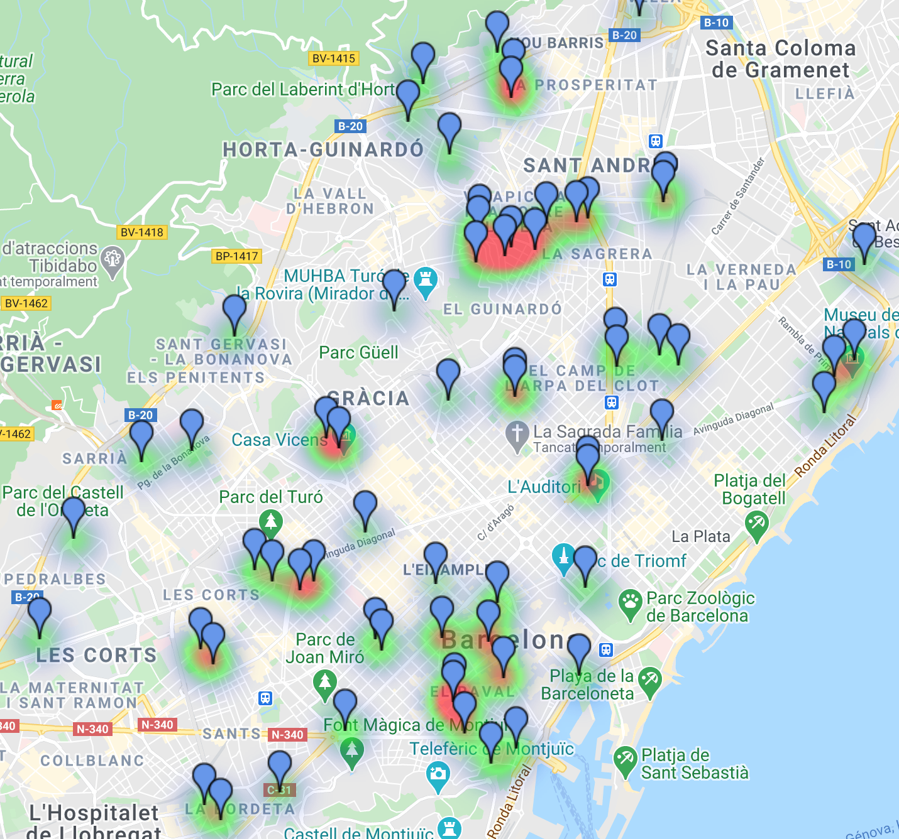
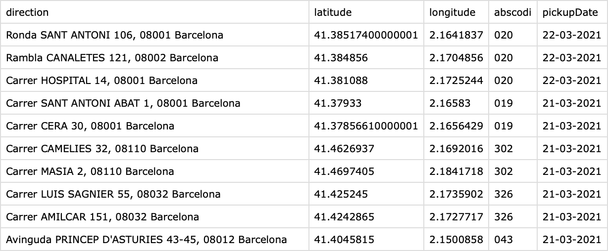

### Recircula Picce Codebase

We are **Picce**!

- Cristina Aguilera (cristina.aguilera.gonzalez@estudiantat.upc.edu)
- Jesus Antonanzas (jesus.maria.antonanzas@estudiantat.upc.edu)
- Irene Josa (irene.josa@upc.edu)
- Paz Ripoll (paz.ripoll@estudiantat.upc.edu)
- Estel Rueda (estel.rueda@upc.edu)

This repository contains software powering our proposal for the Recircula Challenge 2021.

**Note**: tested on Python 3.8.6. 

#### Bin Locator (description)

Automatically places bins around a specified Sanitary Region (only Catalonia) given parameters such as the % of region infection coverage
of the placements, or the maximum number of bins allowed. The coverage of COVID-19 cases is maximized for the given number 
of binsFor now, only farmacies are valid points. It reads, in real time, the number of COVID-19 reports provided by the 
Catalan Government such that the placements are **relevant**. See ("how it works") for a more thorugh description.

The granularity of reported infections is by [Basic Sanitary Area](https://catsalut.gencat.cat/web/.content/minisite/catsalut/proveidors_professionals/registres_catalegs/documents/poblacio-referencia.pdf),
and the infections themselves are extracted from [here](https://analisi.transparenciacatalunya.cat/ca/Salut/Registre-de-casos-de-COVID-19-realitzats-a-Catalun/xuwf-dxjd).
The Catalan farmacies are extracted from [here](https://analisi.transparenciacatalunya.cat/Salut/Cat-leg-de-farm-cies-de-Catalunya/f446-3fny).
The population per ABS is extracted from [here](https://analisi.transparenciacatalunya.cat/en/Salut/Registre-central-de-poblaci-del-CatSalut-poblaci-p/ftq4-h9vk)

#### Bin Locator (usage)

First, navigate to the desired location and clone the repo:

```
git clone https://github.com/chus-chus/picce_recircula.git
```

Create a virtual environment of your choice and install the required packages:

```
pip3 install requirements.txt
```

An example of running the bin locator could be:

```
python3 ./src/binlocator/main.py 
--maxbins 100 
--percCover 0.8 
--exactBins True 
--daysBefore 14
--binCapacity 2000
--popToThrowRatio 0.1
--maskThrowRate 0.33
--apiKey <YOUR_GMAPS_API_KEY>
```

**Available params**:

```
--maxbins: 'Number of bins to be used.' type=int, default=None
--exactBins: 'Should the number of bins used be exact?' type=bool, default=False
--percCover: 'Density of infection cases covered.' type=float, default=1
--sanitaryRegion: 'Sanitary Region Code.' type=int, default=7803
--daysBefore: 'Number of previous days to account for infections from today.' type=int, default=14
--downloadPoints: 'Should points be updated?' type=bool, default=False
--cleanPopulation: 'Is the pop. dataset to be cleaned?' type=bool, default=False
--binCapacity: 'Bin capacity.' type=int, required=True
--maskThrowRate: '# of masks thrown away per person per day.' type=float, default=1/3
--apiKey: 'Google Maps API Key.' type=str, default=''
```

A note on the parameter 'cleanPopulation': The dataset (from [here](https://analisi.transparenciacatalunya.cat/en/Salut/Registre-central-de-poblaci-del-CatSalut-poblaci-p/ftq4-h9vk)) 
must be downloaded and put into ./data/ with the name 'population.csv' if it was not in the directory, 
as it is not downloaded automatically because of the large number of records it contains. The paramenter
should be set to True when it is first downloaded and put into the folder, and after the program execution it will have
been replaced by a clean, aggregated version.

Do also note that downloading new points needs the GMaps API Key to geocode (get coordinates from addresses) and
can consume your Google Cloud Quota, creating extra costs.

#### Bin Locator (how it works)

Given a valid Sanitary Area code, the bin locator (BL) first downloads up-to-date infection data from official sources and, if specified, 
it also downloads candidate points for the bins to be put into. Then, its chooses the ABSs (Basic Sanitary Area)
that account for 'percCover' of the infection density. A new distribution of infection densities is computed
s.t. it sums to 1 for the chosen ABSs (local densities). Given the local infection densities and the available bins
to distribute, the number of bins to be assigned to each ABS is calculated s.t. each picked ABSs gets at least one bin.
Then, each bin is assigned to some available point (drug stores, for example) in a way that the area covered in each ABS is
maximal. Finally, an approximation for the expected pickup date (when the bin will be full) is computed given the assumptions: (1) Percentage
of population that will throw their masks in those bins, (2) the number of masks each person will dispose of each day
and (3) the capacity of the bins. 

#### BL output 
- A .csv file with street address, latitude, longitude and expected pickup date for each of the chosen 
points (output/pointsPicked.csv)
  
- The corresponding map (output/pointsPickedMap.html). You will need to specify the Google Maps API Key to get a map for 
  non-developer use (without watermarks).


Note on downloading new points: Although rare, if for some reason the Google Maps API could not geocode an address (get its coordinates),
a file (./data/incompletePoints.csv) will be created in ./data. It contains each point which could not be geocoded,
and so it should be fixed manually in the file ./data/AvailableBinPoints<SANITARY_REGION>.csv (and rerun the execution).



